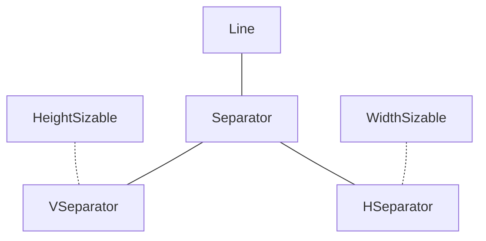
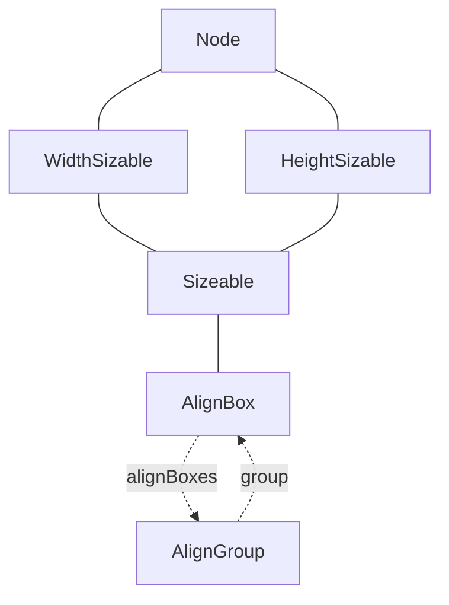
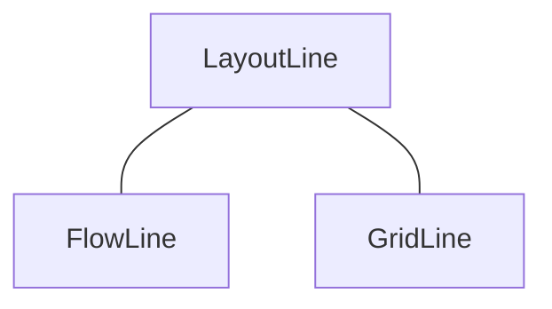
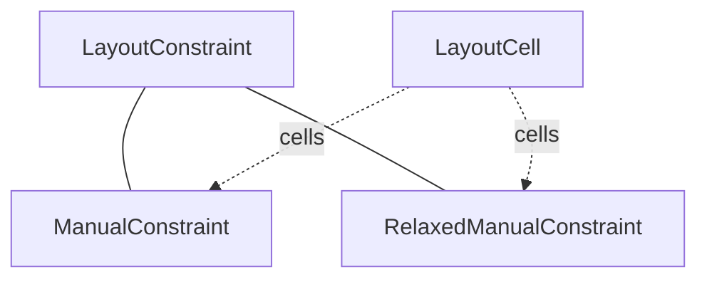

## Table Of Contents
- [Flow Chart Legend](#Flow-Chart-Legend)
- [FlowBox Hierarchy and Composition](#FlowBox-Hierarchy-and-Composition)
- [GridBox Hierarchy & Composition](#GridBox-Hierarchy-and-Composition)
- [Sizable Nodes Top Level Hierarchy](#Sizable-Nodes-Top-Level-Hierarchy)
- [Separators Hierarchy](#Separators-Hierarchy)
- [AlignBox Hierarchy and Composition](#AlignBox-Hierarchy-and-Composition)
- [LayoutLine Hierarchy](#LayoutLine-Hierarchy)
- [ManualConstraint](#ManualConstraint)


## Flow Chart Legend:
- Inheritance: _______
- Mixin: _ _ _ _ _
- Composition: _ _ {{VARIABLE}} _ >

## FlowBox Hierarchy and Composition
```mermaid
flowchart TD
    layoutCell --- MarginLayoutCell
    MarginLayoutCell --- FlowCell
    
    FlowConfigurable -.- FlowCell & FlowConstraint
    
    LayoutConstraint --- NodeLayoutConstraint
    NodeLayoutConstraint --- FlowConstraint
    FlowCell -.cellMap.-> FlowBox
    FlowConstraint -.constraint.-> FlowCell & FlowBox
    
    
    Node --- LayoutNode
    LayoutNode --- FlowBox
    FlowBox --- VBox & HBox

 ```

## GridBox Hierarchy & Composition
```mermaid
flowchart TD
    layoutCell --- MarginLayoutCell
    MarginLayoutCell --- GridCell
    GridConfigurable -.- GridCell & GridConstraint
    
    LayoutConstraint --- NodeLayoutConstraint
    NodeLayoutConstraint --- GridConstraint
    GridCell -.cellMap.-> GridBox
    GridConstraint -.constraint.-> GridCell & GridBox
    
    Node --- LayoutNode
    LayoutNode --- GridBox

 ```

## Sizable Nodes Top Level Hierarchy
```mermaid
flowchart TD
    Node --- WidthSizable & HeightSizable --- Sizable
```

## Separators Hierarchy


## AlignBox Hierarchy and Composition


## LayoutLine Hierarchy


## ManualConstraint
